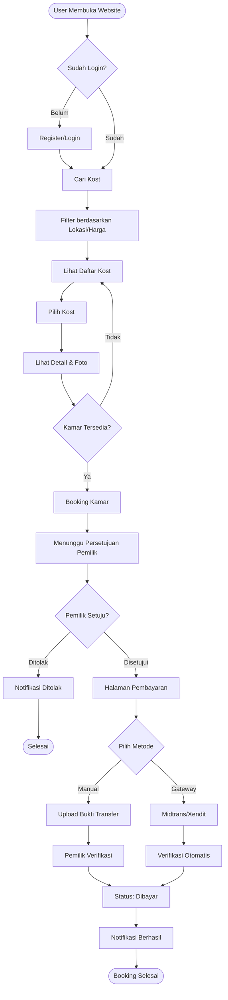
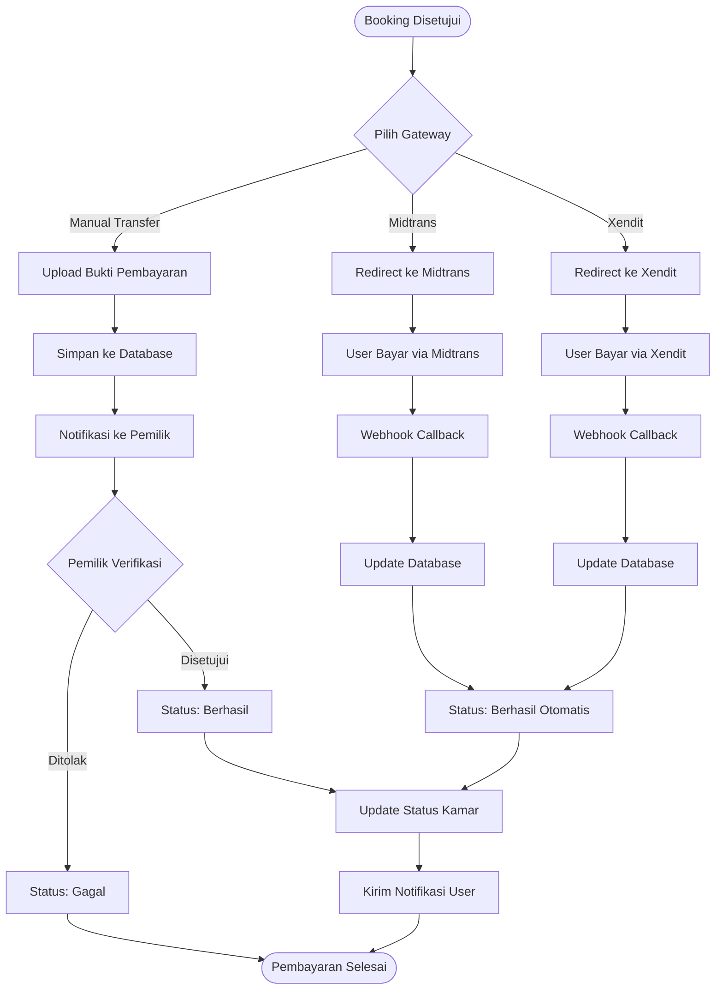
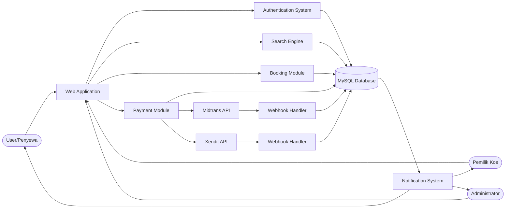

# LAPORAN PROYEK PENGEMBANGAN SISTEM INFORMASI

> **PANDUAN PENGISIAN GAMBAR:**
> Laporan ini membutuhkan gambar-gambar berikut. Silakan simpan file gambar Anda di folder yang sesuai dengan nama file berikut, atau sesuaikan nama file di laporan ini dengan gambar yang Anda miliki.
>
> **Folder:** `assets/images/documentation/use_cases/`
> *   [ ] `use_case_main.png` (Diagram Use Case Utama)
>
> **Folder:** `assets/images/documentation/screenshots/`
> *   [ ] `landing_page.png` (Halaman Depan)
> *   [ ] `login_page.png` (Halaman Login)
> *   [ ] `user_dashboard.png` (Dashboard User)
> *   [ ] `search_result.png` (Hasil Pencarian Kost)
> *   [ ] `booking_detail.png` (Detail Booking)
> *   [ ] `owner_dashboard.png` (Dashboard Pemilik)
> *   [ ] `admin_dashboard.png` (Dashboard Admin)

## JUDUL: KOSCONNECT - APLIKASI MANAJEMEN DAN PENCARIAN KOST

**Disusun Oleh:**
[Nama Anda]
[NIM]

---

## BAB 1: PENDAHULUAN

### 1.1 Latar Belakang
Di era digital saat ini, kebutuhan akan tempat tinggal sementara atau kost semakin meningkat, terutama bagi mahasiswa dan pekerja rantau. Namun, proses pencarian kost seringkali masih dilakukan secara manual yang memakan waktu dan tenaga. Di sisi lain, pemilik kost juga mengalami kesulitan dalam mempromosikan dan mengelola kost mereka secara efisien. "KosConnect" hadir sebagai solusi platform terpadu yang menghubungkan pencari kost dengan pemilik kost, serta menyediakan fitur manajemen yang lengkap.

### 1.2 Rumusan Masalah
1. Bagaimana memudahkan pencari kost dalam menemukan kost yang sesuai dengan kriteria mereka?
2. Bagaimana membantu pemilik kost dalam mengelola data penyewa, pembayaran, dan pemasaran kost?
3. Bagaimana menjamin keamanan dan kemudahan transaksi antara pemilik dan penyewa?

### 1.3 Tujuan Aplikasi
1. Menyediakan platform pencarian kost yang user-friendly dengan fitur filter yang lengkap.
2. Memberikan dashboard manajemen bagi pemilik kost untuk memantau okupansi dan pembayaran.
3. Mengimplementasikan sistem pembayaran digital (Payment Gateway) untuk transaksi yang aman.

---

## BAB 2: ANALISIS DAN PERANCANGAN SISTEM

### 2.1 Analisis Pengguna
Sistem ini memiliki 3 aktor utama:
1.  **Pencari Kos (User):** Dapat mencari, membooking, dan membayar kost.
2.  **Pemilik Kos (Owner):** Dapat mengelola data kost, kamar, harga, dan memverifikasi booking.
3.  **Admin:** Bertanggung jawab atas pengelolaan seluruh sistem, verifikasi pemilik, dan monitoring konten.

### 2.2 Perancangan Sistem

### 2.2 Perancangan Sistem

#### 2.2.1 Use Case Diagram (Skenario)
Berikut adalah rincian skenario penggunaan sistem (Use Case Scenarios) untuk setiap aktor:

| Aktor | Use Case (Fitur) | Deskripsi |
| :--- | :--- | :--- |
| **Pencari Kos** | Register / Login | Mendaftar akun baru dan masuk ke sistem. |
| | Cari Kos | Mencari kos berdasarkan lokasi, harga, dan fasilitas. |
| | Lihat Detail Kos | Melihat foto, deskripsi, harga, dan fasilitas kamar. |
| | Booking Kamar | Melakukan pemesanan kamar yang tersedia. |
| | Pembayaran | Melakukan pembayaran booking via Transfer/E-Wallet (Midtrans/Xendit). |
| | Kelola Profil | Mengubah data diri dan foto profil. |
| **Pemilik Kos** | Kelola Kost | Menambah, mengedit, atau menghapus data kost. |
| | Kelola Kamar | Mengatur ketersediaan kamar dan harga. |
| | Verifikasi Booking | Menerima atau menolak booking masuk. |
| | Laporan Pendapatan | Melihat riwayat transaksi dan pendapatan. |
| **Admin** | Manajemen User | Mengelola data pengguna (blokir/hapus user). |
| | Validasi Kost | Memverifikasi kost baru yang didaftarkan pemilik. |

> **[TEMPAT GAMBAR USE CASE]**
> *Silakan ganti gambar di bawah ini dengan diagram use case Anda.*


#### 2.2.2 Entity Relationship Diagram (ERD) - Skema Database
Sistem menggunakan database relasional MySQL dengan struktur tabel utama sebagai berikut:

1.  **`user`**: Menyimpan data pengguna (Admin, Pemilik, Penyewa).
    *   *Kolom:* `id_user`, `nama_lengkap`, `email`, `password`, `role`, `no_telepon`...
2.  **`kost`**: Menyimpan data properti kost milik pemilik.
    *   *Kolom:* `id_kost`, `id_pemilik`, `nama_kost`, `alamat`, `fasilitas`, `harga`, `gambar`...
3.  **`kamar`**: Menyimpan detail kamar dalam sebuah kost.
    *   *Kolom:* `id_kamar`, `id_kost`, `nama_kamar`, `status` (tersedia/terisi)...
4.  **`booking`**: Mencatat transaksi pemesanan kamar.
    *   *Kolom:* `id_booking`, `id_penyewa`, `id_kamar`, `tanggal_booking`, `status`...
5.  **`pembayaran`**: Mencatat riwayat pembayaran dan gateway (Midtrans/Xendit).
    *   *Kolom:* `id_payment`, `id_booking`, `jumlah`, `metode_pembayaran`, `status_pembayaran`...
6.  **`notifications`**: Menyimpan notifikasi sistem untuk user.
    *   *Kolom:* `id_notification`, `id_user`, `pesan`, `link`, `is_read`...

*(Lihat file `ERD kosConnect.drawio` untuk visualisasi relasi antar tabel)*

#### 2.2.3 Diagram Alur Sistem (Flowchart)

**A. Alur Proses Booking Kamar**



**B. Alur Sistem Pembayaran**



**C. Arsitektur Sistem**



### 2.3 Teknologi yang Digunakan
*   **Backend:** PHP Native (Struktural & OOP)
*   **Frontend:** HTML5, CSS3, JavaScript (Vanilla)
*   **Database:** MySQL
*   **Payment Gateway:** Midtrans / Xendit
*   **Server:** Apache / Nginx
*   **Cloud Storage:** Cloudinary (untuk gambar kost dan profil)

---

## BAB 3: IMPLEMENTASI SISTEM

### 3.1 Struktur Direktori
Aplikasi dibangun dengan struktur modular untuk memudahkan pemeliharaan:

```text
KosConnect/
├── admin/          # Modul Dashboard Admin
├── auth/           # Modul Otentikasi (Login/Register)
├── config/         # Konfigurasi Database & API
├── dashboard/      # Dashboard Utama User
├── pemilik_kos/    # Modul Fitur Pemilik Kos
├── user/           # Fitur User (Booking, Search)
└── assets/         # Asset Statis (Gambar, JS, CSS)
```

### 3.2 Fitur Utama
1.  **Sistem Pencarian:** Menggunakan query SQL yang dioptimalkan dengan filter lokasi dan harga.
2.  **Booking Engine:** Menangani logika ketersediaan kamar dan status pemesanan.
3.  **Integrasi Pembayaran:** Webhook untuk update status pembayaran otomatis secara real-time.
4.  **Sistem Notifikasi:** Memberikan update status booking kepada user dan pemilik.

---

## BAB 4: ANTARMUKA PENGGUNA (USER INTERFACE)

Bagian ini menampilkan tangkapan layar utama dari aplikasi KosConnect.

### 4.1 Halaman Publik & Autentikasi

**Halaman Utama (Landing Page)**


**Halaman Login**


### 4.2 Fitur Pencari Kos (User)

**Dashboard User**


**Hasil Pencarian & Detail Kost**


**Detail Booking**


### 4.3 Fitur Pemilik Kos (Owner)

**Dashboard Pemilik**


### 4.4 Fitur Administrator

**Dashboard Admin**


---

## BAB 5: PENUTUP

### 5.1 Kesimpulan
KosConnect berhasil dikembangkan sebagai solusi komprehensif untuk masalah pencarian dan manajemen kost. Sistem ini telah mencakup seluruh kebutuhan dasar dari ketiga aktor utama (Pencari, Pemilik, Admin) dan terintegrasi dengan gateway pembayaran untuk transaksi non-tunai.

### 5.2 Saran Pengembangan
1. Pengembangan aplikasi mobile (Android/iOS) menggunakan React Native atau Flutter.
2. Integrasi fitur "Virtual Tour" 360 derajat untuk pengalaman melihat kost yang lebih nyata.
3. Penambahan fitur chat real-time menggunakan WebSocket.

---
*Dibuat pada: 2025*
